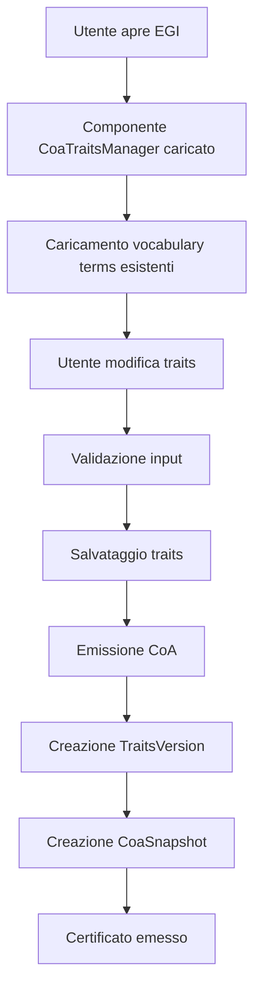

# 📋 DOCUMENTAZIONE COMPLETA SISTEMA COA TRAITS

## 🎯 OVERVIEW DEL SISTEMA

Il sistema **CoA Traits** è un componente avanzato del FlorenceEGI che permette l'aggiunta di **caratteristiche specifiche** alle opere d'arte tramite un'interfaccia dinamica integrata con il sistema di emissione dei **Certificati di Autenticità (CoA)**.

### 🔑 CONCETTI CHIAVE

1. **CoA Traits**: Caratteristiche specifiche dell'opera (tecnica, materiali, supporto, etc.)
2. **Vocabulary Terms**: Termini predefiniti dal sistema con traduzioni multilingua
3. **Custom Terms**: Termini personalizzati inseriti dall'utente
4. **Traits Versioning**: Sistema di versionamento per tracciare modifiche alle caratteristiche
5. **UEM/ULM Integration**: Integrazione con Ultra Error Manager e Ultra Log Manager

---

## 🏗️ ARCHITETTURA DEL SISTEMA

### 📂 STRUTTURA FILES PRINCIPALI

```
app/
├── Models/
│   ├── EgiTraitsVersion.php          # Versioning dei traits
│   ├── CoaSnapshot.php               # Snapshot immutabili CoA
│   └── CoaTrait.php                  # Traits specifici CoA
├── Services/Coa/
│   ├── TraitsSnapshotService.php     # Gestione snapshot traits
│   └── CoaIssueService.php           # Emissione certificati
├── Http/Controllers/
│   └── CoaController.php             # Controller principale CoA
└── Livewire/
    └── CoaTraitsManager.php          # Componente Livewire traits

resources/
├── views/livewire/
│   └── coa-traits-manager.blade.php  # Template interfaccia traits
└── lang/vendor/error-manager/
    ├── it/errors.php                 # Traduzioni errori italiane
    └── en/errors.php                 # Traduzioni errori inglesi

database/migrations/
├── create_egi_traits_version_table.php
├── create_coa_snapshot_table.php
└── add_missing_columns_to_egi_traits_version_table.php
```

### 🔄 FLUSSO OPERATIVO



---

## 🗄️ SCHEMA DATABASE

### 📋 TABELLA: `egi_traits_version`

```sql
CREATE TABLE egi_traits_version (
    id BIGINT PRIMARY KEY AUTO_INCREMENT,
    egi_id BIGINT NOT NULL,                    -- FK verso egis
    version INT DEFAULT 1,                     -- Numero versione
    traits_json JSON NOT NULL,                -- Snapshot traits JSON
    traits_hash VARCHAR(64) NULL,             -- Hash integrità
    change_reason VARCHAR(255) NULL,          -- Motivo modifica
    changed_fields JSON NULL,                 -- Campi modificati
    created_by BIGINT NULL,                   -- FK verso users
    created_at TIMESTAMP NOT NULL,
    updated_at TIMESTAMP NULL,
    UNIQUE KEY unique_egi_version (egi_id, version),
    FOREIGN KEY (egi_id) REFERENCES egis(id) ON DELETE CASCADE,
    FOREIGN KEY (created_by) REFERENCES users(id) ON DELETE SET NULL
);
```

### 📋 TABELLA: `coa_snapshot`

```sql
CREATE TABLE coa_snapshot (
    id BIGINT PRIMARY KEY AUTO_INCREMENT,
    coa_id CHAR(26) UNIQUE NOT NULL,          -- ULID FK verso coa
    snapshot_json JSON NOT NULL,              -- Snapshot completo
    created_at TIMESTAMP NOT NULL,
    updated_at TIMESTAMP NULL,
    FOREIGN KEY (coa_id) REFERENCES coa(id) ON DELETE CASCADE
);
```

### 📋 TABELLA: `coa_traits`

```sql
CREATE TABLE coa_traits (
    id BIGINT PRIMARY KEY AUTO_INCREMENT,
    egi_id BIGINT NOT NULL,                   -- FK verso egis
    technique JSON NULL,                      -- Dati tecnica
    materials JSON NULL,                      -- Dati materiali
    support JSON NULL,                        -- Dati supporto
    created_at TIMESTAMP NULL,
    updated_at TIMESTAMP NULL,
    FOREIGN KEY (egi_id) REFERENCES egis(id) ON DELETE CASCADE
);
```

---

## 🔧 COMPONENTI TECNICI DETTAGLIATI

### 🎮 LIVEWIRE COMPONENT: `CoaTraitsManager`

**File**: `app/Livewire/CoaTraitsManager.php`

#### 🎯 RESPONSABILITÀ
- Gestione interfaccia utente per traits
- Validazione input in tempo reale
- Integrazione con vocabulary terms
- Gestione custom terms personalizzati

#### 🔑 METODI PRINCIPALI

```php
class CoaTraitsManager extends Component
{
    // 📊 PROPRIETÀ
    public $egi;                    // Istanza EGI
    public $coaTraits;             // Traits correnti
    public $vocabularyTerms = [];  // Termini vocabulary
    public $selectedTerms = [];    // Termini selezionati
    public $customTerms = [];      // Termini custom
    
    // 🔄 METODI LIFECYCLE
    public function mount($egi)    // Inizializzazione
    public function render()       // Rendering template
    
    // 🎯 METODI BUSINESS
    public function loadVocabularyTerms()     // Carica termini predefiniti
    public function addCustomTerm()           // Aggiunge termine custom
    public function removeCustomTerm()        // Rimuove termine custom
    public function toggleVocabularyTerm()    // Toggle termine vocabulary
    public function saveTraits()              // Salva modifiche traits
    public function validateTraits()          // Validazione traits
}
```

#### 🎨 TEMPLATE BLADE

**File**: `resources/views/livewire/coa-traits-manager.blade.php`

```blade
<div class="coa-traits-manager">
    <!-- SEZIONE TECNICA -->
    <div class="traits-category" data-category="technique">
        <h3>{{ __('Tecnica') }}</h3>
        
        <!-- Vocabulary Terms -->
        <div class="vocabulary-terms">
            @foreach($vocabularyTerms['technique'] ?? [] as $term)
                <label class="term-checkbox">
                    <input type="checkbox" 
                           wire:model="selectedTerms.technique.vocabulary" 
                           value="{{ $term['slug'] }}">
                    {{ $term['name'] }}
                </label>
            @endforeach
        </div>
        
        <!-- Custom Terms -->
        <div class="custom-terms">
            <input type="text" 
                   wire:model="customTerms.technique.new"
                   placeholder="Aggiungi termine personalizzato...">
            <button wire:click="addCustomTerm('technique')">Aggiungi</button>
        </div>
    </div>
    
    <!-- SEZIONE MATERIALI -->
    <!-- Similar structure... -->
    
    <!-- SEZIONE SUPPORTO -->
    <!-- Similar structure... -->
    
    <!-- AZIONI -->
    <div class="traits-actions">
        <button wire:click="saveTraits()" class="btn-primary">
            Salva Caratteristiche
        </button>
    </div>
</div>
```

### 🔧 SERVICE: `TraitsSnapshotService`

**File**: `app/Services/Coa/TraitsSnapshotService.php`

#### 🎯 RESPONSABILITÀ
- Creazione snapshot traits versionati
- Generazione hash di integrità
- Gestione audit trail modifiche
- Integrazione con UEM per errori

#### 🔑 METODI PRINCIPALI

```php
class TraitsSnapshotService
{
    // 📸 SNAPSHOT MANAGEMENT
    public function createTraitsVersion(
        Egi $egi, 
        string $changeReason = 'CoA issuance', 
        array $changedFields = []
    ): ?EgiTraitsVersion {
        // 1. Estrae traits correnti
        $currentTraits = $this->extractCurrentTraits($egi);
        
        // 2. Genera hash integrità
        $traitsHash = $this->generateTraitsHash($currentTraits);
        
        // 3. Ottiene numero versione successivo
        $nextVersion = $this->getNextVersionNumber($egi);
        
        // 4. Crea record versioning
        return EgiTraitsVersion::create([
            'egi_id' => $egi->id,
            'version' => $nextVersion,
            'traits_json' => $currentTraits,
            'traits_hash' => $traitsHash,
            'change_reason' => $changeReason,
            'changed_fields' => $changedFields,
        ]);
    }
    
    public function createCoaSnapshot(
        Coa $coa, 
        EgiTraitsVersion $traitsVersion
    ): ?CoaSnapshot {
        // Crea snapshot immutabile per CoA
        return CoaSnapshot::create([
            'coa_id' => $coa->id,
            'snapshot_json' => $traitsVersion->traits_json,
        ]);
    }
    
    // 🔧 UTILITY METHODS
    private function extractCurrentTraits(Egi $egi): array
    private function generateTraitsHash(array $traits): string
    private function getNextVersionNumber(Egi $egi): int
}
```

### 🎯 SERVICE: `CoaIssueService`

**File**: `app/Services/Coa/CoaIssueService.php`

#### 🎯 RESPONSABILITÀ
- Orchestrazione emissione certificati
- Integrazione con traits versioning
- Gestione transazioni database
- Error handling con UEM

#### 🔄 FLUSSO EMISSIONE COA

```php
public function issueCertificate(
    Egi $egi, 
    ?string $issuedBy = null, 
    ?string $notes = null
): ?Coa {
    return DB::transaction(function () use ($egi, $issuedBy, $notes) {
        // 1. Validazioni autorizzazione
        $user = Auth::user();
        if ($egi->user_id !== $user->id) {
            throw new AuthorizationException();
        }
        
        // 2. Crea versione traits
        $traitsVersion = $this->snapshotService->createTraitsVersion(
            $egi, 'CoA issuance', ['all']
        );
        
        // 3. Crea certificato CoA
        $coa = $this->createCoaRecord($egi, $issuedBy, $notes);
        
        // 4. Crea snapshot immutabile
        $snapshot = $this->snapshotService->createCoaSnapshot($coa, $traitsVersion);
        
        // 5. Registra evento emissione
        $this->createCoaEvent($coa, 'coa_issued', [...]);
        
        return $coa;
    });
}
```

---

## 🎨 INTERFACCIA UTENTE

### 🖼️ LAYOUT COMPONENTE

```
┌─────────────────────────────────────────────────────────┐
│                 COA TRAITS MANAGER                      │
├─────────────────────────────────────────────────────────┤
│ 🎨 TECNICA                                              │
│ ☐ Pittura ad olio    ☐ Acquerello    ☐ Tempera        │
│ ☐ Acrilico          ☐ Pastelli      ☐ Carboncino      │
│ [Termine personalizzato...] [Aggiungi]                 │
├─────────────────────────────────────────────────────────┤
│ 🧱 MATERIALI                                            │
│ ☐ Tela              ☐ Carta         ☐ Legno           │
│ ☐ Metallo           ☐ Ceramica      ☐ Vetro           │
│ [Termine personalizzato...] [Aggiungi]                 │
├─────────────────────────────────────────────────────────┤
│ 📋 SUPPORTO                                             │
│ ☐ Telaio            ☐ Pannello      ☐ Tavola          │
│ ☐ Cartone           ☐ Masonite      ☐ MDF             │
│ [Termine personalizzato...] [Aggiungi]                 │
├─────────────────────────────────────────────────────────┤
│              [Salva Caratteristiche]                   │
└─────────────────────────────────────────────────────────┘
```

### 🎯 STATI INTERFACCIA

1. **Loading**: Caricamento vocabulary terms
2. **Ready**: Interfaccia pronta per input
3. **Saving**: Salvataggio in corso
4. **Error**: Gestione errori con UEM
5. **Success**: Conferma operazione completata

---

## 🔗 INTEGRAZIONE UEM/ULM

### 📋 CODICI ERRORE STANDARD

```php
// ERRORI TRAITS VERSIONING
'COA_TRAITS_VERSION_CREATE_ERROR' => [
    'dev' => 'Errore creazione versione traits. EGI ID: :egi_id, Errore: :error',
    'user' => 'Impossibile creare lo snapshot delle caratteristiche dell\'opera.'
],

// ERRORI SNAPSHOT
'COA_SNAPSHOT_CREATE_ERROR' => [
    'dev' => 'Errore creazione snapshot CoA. CoA ID: :coa_id, Errore: :error', 
    'user' => 'Impossibile creare lo snapshot del certificato.'
],

// ERRORI EMISSIONE
'COA_ISSUE_CERTIFICATE_ERROR' => [
    'dev' => 'Emissione certificato fallita. EGI ID: :egi_id, Errore: :error',
    'user' => 'Impossibile emettere il Certificato di Autenticità. Riprova.'
],
```

### 🔧 PATTERN GESTIONE ERRORI

```php
try {
    // Operazione business logic
    $result = $this->performOperation();
    return $result;
    
} catch (\Exception $e) {
    // Log dettagliato per debug
    \Log::error('[Service] Errore durante operazione', [
        'error_message' => $e->getMessage(),
        'error_file' => $e->getFile(),
        'error_line' => $e->getLine(),
        'error_trace' => $e->getTraceAsString(),
        'context' => $additionalContext
    ]);
    
    // Gestione UEM standard - SENZA parametri extra
    $this->errorManager->handle('ERROR_CODE', [], $e);
    
    // Return null per indicare fallimento
    return null;
}
```

---

## 🚀 DEPLOYMENT E MIGRATION

### 📦 MIGRATIONS NECESSARIE

```bash
# 1. Creazione tabelle base
php artisan migrate --path=database/migrations/create_egi_traits_version_table.php
php artisan migrate --path=database/migrations/create_coa_snapshot_table.php

# 2. Aggiunta colonne mancanti (fix problemi staging)
php artisan migrate --path=database/migrations/add_missing_columns_to_egi_traits_version_table.php
php artisan migrate --path=database/migrations/add_updated_at_to_coa_snapshot_table.php
```

### 🔧 CONFIGURAZIONE MODELS

**Punti critici per modelli:**

```php
class EgiTraitsVersion extends Model {
    // ✅ ABILITARE timestamps
    public $timestamps = true;
    
    // ✅ FILLABLE completo
    protected $fillable = [
        'egi_id', 'version', 'traits_json', 
        'traits_hash', 'change_reason', 'changed_fields', 'created_by'
    ];
    
    // ✅ CASTS appropriati
    protected $casts = [
        'traits_json' => 'array',
        'changed_fields' => 'array',
        'created_at' => 'datetime',
        'updated_at' => 'datetime',
    ];
}
```

---

## 🐛 TROUBLESHOOTING COMUNE

### ❌ ERRORI FREQUENTI E SOLUZIONI

#### 1. **Error: `mb_substr(): Argument #1 ($string) must be of type string, array given`**

**Causa**: ErrorManager riceve parametri array invece che stringa
**Soluzione**: Rimuovere parametri extra dalle chiamate `errorManager->handle()`

```php
// ❌ SBAGLIATO
$this->errorManager->handle('ERROR_CODE', [
    'param1' => $value1,
    'param2' => $value2
], $exception);

// ✅ CORRETTO
$this->errorManager->handle('ERROR_CODE', [], $exception);
```

#### 2. **Error: `Column not found: 1054 Unknown column 'traits_hash'`**

**Causa**: Migration non eseguita o colonne mancanti
**Soluzione**: Eseguire migration di aggiornamento

```bash
php artisan migrate
```

#### 3. **Error: `Field 'created_at' doesn't have a default value`**

**Causa**: Model ha `timestamps = false` ma tabella richiede timestamps
**Soluzione**: Abilitare timestamps nel model

```php
public $timestamps = true;
```

#### 4. **Error: `Expected type 'App\Models\EgiTraitsVersion'. Found 'null'`**

**Causa**: Return type non nullable ma metodo può restituire null
**Soluzione**: Aggiornare signature metodo

```php
// ✅ CORRETTO
public function createTraitsVersion(...): ?EgiTraitsVersion
```

---

## 📚 BEST PRACTICES

### 🎯 CODICE

1. **UEM Pattern**: Sempre usare array vuoto `[]` per parametri ErrorManager
2. **Nullable Returns**: Service methods che possono fallire devono restituire `?Type`
3. **Transactions**: Operazioni CoA sempre wrappate in DB::transaction()
4. **Logging**: Log dettagliato per debug prima di chiamare UEM
5. **Timestamps**: Sempre abilitare timestamps su models con date

### 🗄️ DATABASE

1. **Migrations**: Sempre creare migration per modifiche schema
2. **Foreign Keys**: Definire correttamente relazioni e cascade
3. **Indexes**: Aggiungere indici per performance query frequenti
4. **JSON Fields**: Usare casting array per campi JSON

### 🎨 FRONTEND

1. **Livewire**: Usare wire:model per binding real-time
2. **Validation**: Validazione client-side + server-side
3. **UX**: Feedback immediato per azioni utente
4. **Loading States**: Gestire stati di caricamento

---

## 🔮 ESTENSIONI FUTURE

### 🚀 FUNZIONALITÀ PIANIFICATE

1. **Import/Export Traits**: Importazione massiva caratteristiche
2. **Traits Templates**: Template predefiniti per tipologie opere
3. **AI Suggestions**: Suggerimenti AI per caratteristiche
4. **Bulk Operations**: Operazioni di massa su più EGI
5. **Advanced Search**: Ricerca avanzata per traits
6. **Traits Analytics**: Analytics e statistiche traits

### 🔧 MIGLIORAMENTI TECNICI

1. **Caching**: Cache vocabulary terms per performance
2. **Queue Jobs**: Operazioni pesanti in background
3. **API Integration**: Endpoint API per traits management
4. **Webhooks**: Notifiche eventi traits modificati
5. **Audit Advanced**: Audit trail più dettagliato

---

## 📞 SUPPORTO E MANUTENZIONE

### 🛠️ TEAM DI RIFERIMENTO

- **Lead Developer**: Fabio Cherici (Architecture & Business Logic)
- **AI Partner**: OS3.0 (Implementation & Documentation)
- **Framework**: FlorenceEGI CoA Pro System
- **Version**: 1.0.0

### 📋 CHECKLIST MANUTENZIONE

- [ ] Monitor performance query database
- [ ] Verificare integrità hash traits versions
- [ ] Cleanup snapshots obsoleti
- [ ] Aggiornamento vocabulary terms
- [ ] Test regressione su staging
- [ ] Backup database prima modifiche

---

**🎯 NOTA PER FUTURE IA**: Questo documento rappresenta lo stato completo del sistema CoA Traits al 21/09/2025. Per qualsiasi modifica o estensione, seguire i pattern UEM/ULM documentati e mantenere la coerenza architetturale descritta.