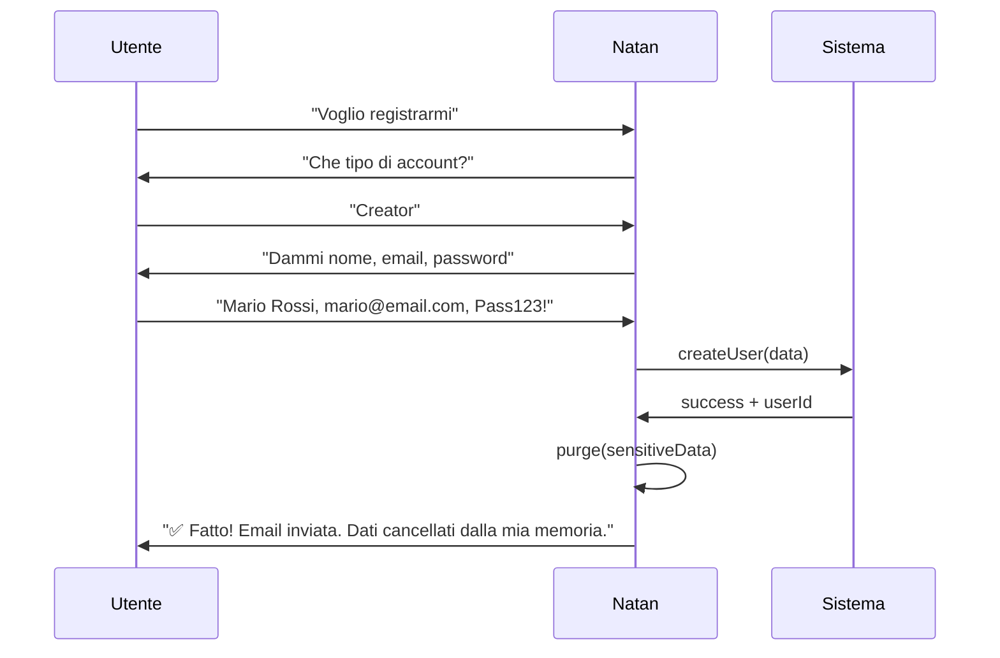
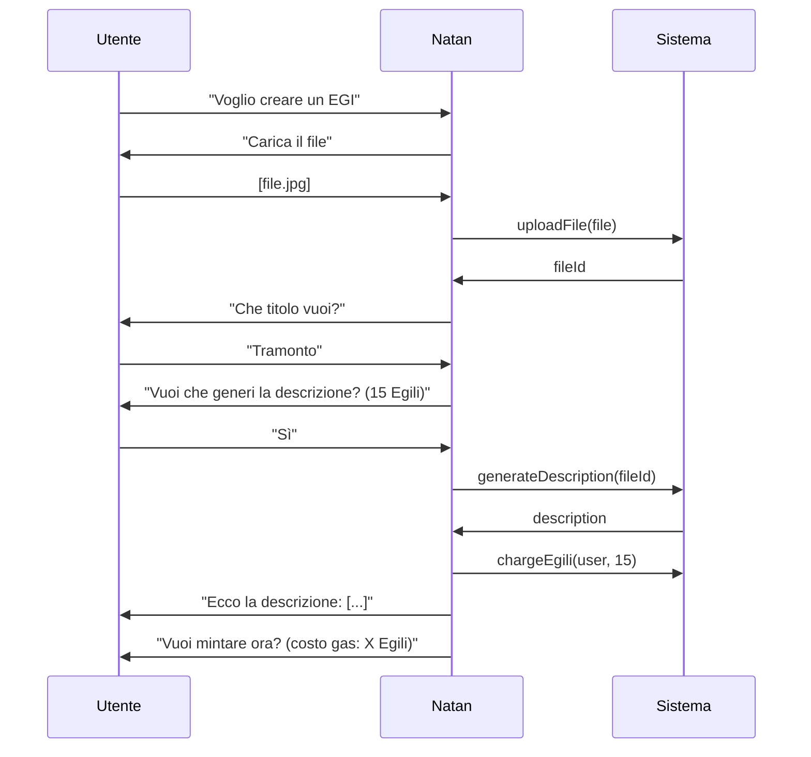

# 🤖 NATAN AGENT - AI Assistant di Nuova Generazione

**Versione:** 1.1.0  
**Data:** 2025-11-26  
**Autore:** Fabio Cherici + Padmin D. Curtis  
**Status:** ✅ DESIGN COMPLETATO - Pronto per Implementazione

---

## 📋 Indice

1. [Visione](#1-visione)
2. [Differenze con Sistema Attuale](#2-differenze-con-sistema-attuale)
3. [Capacità dell'Agente](#3-capacità-dellagente)
4. [Architettura Tecnica](#4-architettura-tecnica)
5. [Knowledge Base (MongoDB + Anti-Allucinazioni)](#5-knowledge-base)
6. [Workflow Conversazionali](#6-workflow-conversazionali)
7. [Sicurezza Dati Sensibili](#7-sicurezza-dati-sensibili)
8. [UI/UX - Natan Avatar](#8-uiux---natan-avatar)
9. [Implementazione](#9-implementazione)
10. [Decisioni Prese](#10-decisioni-prese)
11. [Priorità Azioni](#11-priorità-azioni)
12. [Visual Identity - Natan](#12-visual-identity---natan)

---

## 1. Visione

### 🎯 Mission

**Natan Agent** è l'evoluzione definitiva dell'assistenza utente: un **AI Agent autonomo** stile Jarvis che:

-   È **sempre presente** (omnipresente)
-   **Capisce** il linguaggio naturale
-   **Esegue azioni** per conto dell'utente
-   **Guida** nei processi complessi
-   **Risponde** a qualsiasi domanda sulla piattaforma
-   **Gestisce dati sensibili** in modo sicuro

### 💡 Filosofia

> "Non devi sapere come funziona la piattaforma. Dì a Natan cosa vuoi fare, lui lo fa per te."

---

## 2. Differenze con Sistema Attuale

| Aspetto       | Natan Assistant (vecchio) | Natan Tutor (design doc) | **Natan Agent (nuovo)**          |
| ------------- | ------------------------- | ------------------------ | -------------------------------- |
| **Tipo**      | Helper informativo        | Assistente operativo     | AI Agent autonomo                |
| **Input**     | Click su ?                | Comandi predefiniti      | Linguaggio naturale              |
| **Output**    | Tooltip/Modal             | Azioni + costi fissi     | Conversazione + azioni           |
| **AI**        | Nessuna (statico)         | Limitata                 | Claude con tools                 |
| **Utenti**    | Solo loggati              | Solo loggati             | Tutti (anche guest)              |
| **Azioni**    | Nessuna                   | Lista fissa              | Qualsiasi azione piattaforma     |
| **Knowledge** | Hardcoded                 | Hardcoded                | MongoDB + RAG anti-allucinazioni |
| **Sicurezza** | N/A                       | Egili check              | Gestione dati sensibili + purge  |

---

## 3. Capacità dell'Agente

### 3.1 Azioni Autonome (Esegue per l'utente)

#### 🔐 Autenticazione

```
Utente: "Voglio registrarmi"
Natan: "Perfetto! Che tipo di account vuoi creare?
        1. Creator - per chi crea e vende opere
        2. Collector - per chi colleziona
        3. Entrambi

        Dimmi quale preferisci e ti guido!"

Utente: "Creator"
Natan: "Ottimo! Per creare il tuo account Creator ho bisogno di:
        • Nome e Cognome
        • Email
        • Password (min 8 caratteri)

        Dimmi tutto, oppure procediamo uno alla volta?"

Utente: "Mario Rossi, mario@email.com, password123"
Natan: "✅ Account creato con successo!

        Ho inviato un'email di conferma a mario@email.com.

        ⚠️ IMPORTANTE: Ho già cancellato dalla mia memoria
        tutti i tuoi dati sensibili (password, email).

        Vuoi che ti guidi nel tuo primo EGI?"
```

#### 🎨 Creazione EGI

```
Utente: "Devo creare un EGI"
Natan: "Benissimo! Per creare un EGI ti serve:
        1. Un file (immagine, video, audio, documento)
        2. Un titolo
        3. Una descrizione

        Hai già il file pronto? Puoi caricarlo qui 👇
        [📎 Carica File]"

Utente: [carica immagine]
Natan: "Bellissima opera! 🎨 Vedo che è un'immagine JPG.

        Come vuoi chiamarla?"

Utente: "Tramonto sul mare"
Natan: "Perfetto! Vuoi che scriva io una descrizione
        analizzando l'immagine? (costa 15 Egili)

        Oppure preferisci scriverla tu?"
```

#### 💰 Acquisti

```
Utente: "Voglio comprare Egili"
Natan: "Ecco le opzioni disponibili:

        💎 100 Egili - €10
        💎 500 Egili - €45 (sconto 10%)
        💎 1000 Egili - €80 (sconto 20%)

        Quale pacchetto preferisci?"

Utente: "500"
Natan: "Ti porto al checkout sicuro per 500 Egili (€45).
        [🛒 Vai al Pagamento]"
```

### 3.2 Azioni Informative (Gratuito, RAG-powered)

```
Utente: "Come funzionano le royalties?"
Natan: "Le royalties su FlorenceEGI funzionano così:

        **Al primo mint:**
        • Creator: 68%
        • Natan (piattaforma): 10%
        • EPP: 20%
        • Frangette: 2%

        **Sulle rivendite (rebind):**
        • Creator: 4.5%
        • Altri: percentuali ridotte

        Vuoi sapere di più su qualche aspetto specifico?"
```

### 3.3 Navigazione Guidata

```
Utente: "Portami alle mie opere"
Natan: "Ti porto subito!
        [Navigazione a /creator/works]

        Qui vedi tutte le tue opere. Ce ne sono 5:
        • 3 pubblicate
        • 1 in bozza
        • 1 in attesa di mint

        Cosa vuoi fare?"
```

---

## 4. Architettura Tecnica

```
┌─────────────────────────────────────────────────────────────────┐
│                        NATAN AGENT                               │
├─────────────────────────────────────────────────────────────────┤
│                                                                  │
│  ┌──────────────┐                                               │
│  │   CHAT UI    │ ← Sempre visibile (bubble bottom-right)       │
│  │  (Frontend)  │                                               │
│  └──────┬───────┘                                               │
│         │                                                        │
│         ▼                                                        │
│  ┌──────────────────────────────────────────────────────────┐   │
│  │              NATAN AGENT CONTROLLER                       │   │
│  │              /api/natan-agent/chat                        │   │
│  └──────────────────────────────────────────────────────────┘   │
│         │                                                        │
│         ▼                                                        │
│  ┌──────────────────────────────────────────────────────────┐   │
│  │              NATAN AGENT SERVICE                          │   │
│  │                                                           │   │
│  │  ┌─────────────┐  ┌─────────────┐  ┌─────────────┐       │   │
│  │  │   CLAUDE    │  │  KNOWLEDGE  │  │   ACTION    │       │   │
│  │  │   (LLM)     │  │    BASE     │  │  EXECUTOR   │       │   │
│  │  │             │  │  (MongoDB)  │  │             │       │   │
│  │  └──────┬──────┘  └──────┬──────┘  └──────┬──────┘       │   │
│  │         │                │                │               │   │
│  │         ▼                ▼                ▼               │   │
│  │  ┌─────────────────────────────────────────────────┐     │   │
│  │  │            TOOL ORCHESTRATOR                     │     │   │
│  │  │                                                  │     │   │
│  │  │  Claude riceve la query + context e decide:     │     │   │
│  │  │  • Rispondere (info)                            │     │   │
│  │  │  • Eseguire tool (azione)                       │     │   │
│  │  │  • Chiedere conferma                            │     │   │
│  │  │  • Chiedere più info                            │     │   │
│  │  └─────────────────────────────────────────────────┘     │   │
│  │                                                           │   │
│  └──────────────────────────────────────────────────────────┘   │
│                                                                  │
│  ┌──────────────────────────────────────────────────────────┐   │
│  │                    AVAILABLE TOOLS                        │   │
│  │                                                           │   │
│  │  🔐 AUTH          🎨 CREATOR        💰 COMMERCE           │   │
│  │  • register       • uploadFile      • buyEgili            │   │
│  │  • login          • createEgi       • checkout            │   │
│  │  • logout         • mintEgi         • getBalance          │   │
│  │  • resetPassword  • createCollection                      │   │
│  │                   • setPrice                              │   │
│  │  🧭 NAVIGATION    • publish         📚 KNOWLEDGE          │   │
│  │  • navigateTo     • generateDesc    • searchKnowledge     │   │
│  │  • getCurrentPage • generateTags    • explainFeature      │   │
│  │  • getUserContext                   • getFAQ              │   │
│  │                                                           │   │
│  │  👤 USER          🛒 COLLECTOR                            │   │
│  │  • getProfile     • reserveEgi                            │   │
│  │  • updateProfile  • cancelReservation                     │   │
│  │  • getWorks       • getReservations                       │   │
│  │                                                           │   │
│  └──────────────────────────────────────────────────────────┘   │
│                                                                  │
└─────────────────────────────────────────────────────────────────┘
```

---

## 5. Knowledge Base

### 5.1 Fonte: NATAN_loc

Il sistema di knowledge base verrà portato da **NATAN_loc** e include:

-   **MongoDB** per storage documenti
-   **Sistema anti-allucinazioni** evoluto
-   **RAG** con retrieval semantico

### 5.2 Contenuti Knowledge Base

| Categoria      | Esempi                                          |
| -------------- | ----------------------------------------------- |
| **Platform**   | Cos'è FlorenceEGI, come funziona, mission       |
| **EGI**        | Cos'è un EGI, differenza con NFT, processo mint |
| **Egili**      | Token interno, come si compra, come si usa      |
| **Creator**    | Come diventare creator, upload, pricing         |
| **Collector**  | Come comprare, prenotare, collezione            |
| **Royalties**  | Percentuali, rebind, distribuzione              |
| **Blockchain** | Algorand, wallet, transazioni                   |
| **GDPR**       | Privacy, dati, diritti utente                   |

### 5.3 Anti-Allucinazioni

```
Sistema da NATAN_loc:
- Confidence scoring
- Source attribution
- Fallback: "Non ho informazioni su questo, ma posso cercare..."
- Citation dei documenti fonte
```

---

## 6. Workflow Conversazionali

### 6.1 Registrazione Completa



### 6.2 Creazione EGI Assistita



---

## 7. Sicurezza Dati Sensibili

### 7.1 Principio: Memory Purge

Natan **NON conserva** in memoria/log:

-   Password
-   Email (dopo verifica)
-   Dati di pagamento
-   Documenti d'identità

### 7.2 Implementazione

```php
class SensitiveDataHandler
{
    // Dati che vengono usati e poi cancellati
    private array $volatileData = [];

    public function storeTemporary(string $key, mixed $value): void
    {
        $this->volatileData[$key] = $value;
    }

    public function useAndPurge(string $key): mixed
    {
        $value = $this->volatileData[$key] ?? null;
        unset($this->volatileData[$key]);

        // Log che il dato è stato usato e cancellato
        Log::info("Sensitive data '{$key}' used and purged");

        return $value;
    }

    public function purgeAll(): void
    {
        $keys = array_keys($this->volatileData);
        $this->volatileData = [];

        Log::info("All sensitive data purged", ['keys' => $keys]);
    }
}
```

### 7.3 Messaggi all'Utente

```
"⚠️ Ho appena cancellato dalla mia memoria tutti i tuoi dati sensibili
(password, email). Non li ricordo più e non sono salvati da nessuna parte."
```

---

## 8. UI/UX

### 8.1 Chat Bubble (Sempre Visibile)

```
                                    ┌──────────┐
                                    │   🎩    │
                                    │  Natan   │
                                    └──────────┘
                                         │
                                         ▼
┌─────────────────────────────────────────────────────────────┐
│  🎩 Ciao! Sono Natan, il tuo assistente.              ─ ✕  │
│     Come posso aiutarti oggi?                               │
├─────────────────────────────────────────────────────────────┤
│                                                             │
│  [💡 Suggerimenti rapidi:]                                  │
│  • "Voglio registrarmi"                                     │
│  • "Come funziona FlorenceEGI?"                            │
│  • "Aiutami a creare il mio primo EGI"                     │
│                                                             │
├─────────────────────────────────────────────────────────────┤
│  💬 Scrivi un messaggio...                         [Invia]  │
└─────────────────────────────────────────────────────────────┘
```

### 8.2 Stati della Chat

1. **Collapsed**: Solo bubble con icona Natan
2. **Expanded**: Chat completa
3. **Thinking**: Animazione mentre processa
4. **Action Required**: Richiede input (es. upload file)
5. **Confirmation**: Richiede conferma per azione

### 8.3 Elementi Speciali

-   **Upload Zone**: Drag & drop per file
-   **Action Cards**: Per confermare azioni con costi
-   **Navigation Links**: Click per navigare
-   **Code Blocks**: Per mostrare transazioni/hash

---

## 9. Implementazione

### 9.1 Fase 1: Core Agent (Backend)

```
app/Services/NatanAgent/
├── NatanAgentService.php       # Orchestratore principale
├── ToolRegistry.php            # Registro tools disponibili
├── ConversationManager.php     # Gestione conversazioni
├── SensitiveDataHandler.php    # Gestione dati sensibili
└── Tools/
    ├── AuthTools.php           # register, login, etc.
    ├── CreatorTools.php        # upload, mint, etc.
    ├── NavigationTools.php     # navigate, context
    ├── KnowledgeTools.php      # search, explain
    └── CommerceTools.php       # buy, checkout
```

### 9.2 Fase 2: Knowledge Base (MongoDB)

```
- Importare sistema da NATAN_loc
- Configurare MongoDB connection
- Popolare con documentazione piattaforma
- Testare anti-allucinazioni
```

### 9.3 Fase 3: Frontend

```
resources/ts/components/natan-agent/
├── NatanAgent.ts               # Main controller
├── NatanAgentUI.ts             # Chat interface
├── NatanAgentAPI.ts            # Backend calls
├── MessageRenderer.ts          # Render messaggi
├── ActionConfirmation.ts       # Dialoghi conferma
└── FileUploader.ts             # Upload inline
```

### 9.4 Fase 4: Integrazione

```
- Collegare a tutti i servizi esistenti
- Test end-to-end
- Tuning prompts Claude
- Ottimizzazione performance
```

---

## 10. Decisioni Prese ✅

### Risposte di Fabio (25/11/2025):

1. **NATAN_LOC**: Integrazione la prossima settimana quando sarà in staging. Sistema RAG-Fortress già documentato.

2. **Utenti Guest** possono:

    - ✅ Rispondere a qualsiasi domanda sulla piattaforma
    - ✅ Ricevere suggerimenti di domande da Natan
    - ✅ Registrarsi con guida Natan

3. **Costi Egili**:

    - ✅ Tutte le azioni costano Egili
    - ✅ Natan spiega il costo PRIMA di ogni azione
    - ✅ Chiede conferma OGNI volta
    - ✅ Tutto loggato con sistema GDPR avanzato
    - ✅ User vede movimenti nel suo estratto conto

4. **Limiti**:

    - ❌ Eliminazione account → solo manualmente dall'utente
    - ❌ Cancellazione password → operazione manuale
    - ⚠️ Azioni "brutali" richiedono intervento diretto utente

5. **Lingua**:

    - ✅ Localizzato IT/EN (due lingue per ora)

6. **Priorità Azioni**: Da definire insieme (vedi sotto)

7. **UI**:
    - ✅ Creare qualcosa di NUOVO e mai visto prima!

---

## 11. Priorità Azioni - Da Definire

### Proposta di categorizzazione:

#### 🟢 FASE 1 - MVP (Subito)

| #   | Azione                    | Descrizione                             | Costo Egili  |
| --- | ------------------------- | --------------------------------------- | ------------ |
| 1   | **Chat libera**           | Risponde a domande sulla piattaforma    | 0 (gratuito) |
| 2   | **Suggerimenti**          | Propone domande intelligenti all'utente | 0            |
| 3   | **Registrazione guidata** | Guida step-by-step nella registrazione  | 0            |
| 4   | **Navigazione**           | "Portami a...", "Dove trovo..."         | 0            |
| 5   | **Spiegazioni**           | "Cos'è un EGI?", "Come funziona..."     | 0            |

#### 🟡 FASE 2 - Azioni Creator

| #   | Azione                    | Descrizione                            | Costo Egili |
| --- | ------------------------- | -------------------------------------- | ----------- |
| 6   | **Upload file**           | Carica opera con guida                 | 5           |
| 7   | **Crea Collection**       | "Crea una collection chiamata X"       | 5           |
| 8   | **Genera descrizione AI** | Analizza immagine e scrive descrizione | 15          |
| 9   | **Genera tags AI**        | Suggerisce tag per l'opera             | 5           |
| 10  | **Mint EGI**              | Esegue il mint on-chain                | 10          |

#### 🔴 FASE 3 - Azioni Avanzate

| #   | Azione                | Descrizione                    | Costo Egili |
| --- | --------------------- | ------------------------------ | ----------- |
| 11  | **Prenota EGI**       | Prenota un'opera per collector | 5           |
| 12  | **Imposta prezzo**    | Modifica prezzo opera          | 2           |
| 13  | **Pubblica opera**    | Rende visibile l'opera         | 2           |
| 14  | **Acquista Egili**    | Guida all'acquisto Egili       | 0           |
| 15  | **Tutorial completo** | Sessione guidata completa      | 20          |

### ❓ Domanda per Fabio:

**Quali azioni vuoi nella FASE 1 (MVP)?**

Suggerisco di iniziare con:

1. Chat libera (risponde a domande)
2. Suggerimenti intelligenti
3. Navigazione assistita
4. Registrazione guidata
5. Spiegazioni piattaforma

Queste sono tutte **gratuite** e permettono di testare l'architettura prima di aggiungere le azioni a pagamento.

✅ **CONFERMATO** - Questa priorità è approvata.

---

## 12. Visual Identity - Natan

### 🎭 Chi è Natan

**Natan** è un'entità aliena fatta di **finissimi filamenti colorati** chiamati "**Frange**" (da cui il nome dell'associazione **Frangette**). Attraverso questi filamenti scorre **Equilibrium**, l'energia vitale della piattaforma.

### 🖼️ Riferimenti Visivi

Natan ha diverse rappresentazioni:

| Tipo                      | Descrizione                                                                                                    | Uso                           |
| ------------------------- | -------------------------------------------------------------------------------------------------------------- | ----------------------------- |
| **Volto**                 | Lineamenti umanoidi formati da filamenti multicolore (arancio, ciano, viola, giallo). Occhi chiusi/meditativi. | Avatar principale per la chat |
| **Corpo intero (scuro)**  | Figura eterea su sfondo nero, filamenti luminosi, zone colorate (cuore rosso, arti blu/verdi)                  | Immagini promozionali         |
| **Corpo intero (chiaro)** | Struttura più organica/biomeccanica con punti luminosi (nodi energetici)                                       | Illustrazioni dettagliate     |
| **Logo Frangette**        | Groviglio di fili colorati - l'essenza pura delle frange                                                       | Bubble minimizzato            |

### 🎨 Palette Colori Natan

```
Primari:
- Arancione vibrante: #FF6B35
- Ciano brillante: #00D4FF
- Viola profondo: #8B5CF6
- Giallo energia: #FFD700
- Rosa magenta: #FF1493

Secondari:
- Verde smeraldo: #10B981
- Blu elettrico: #3B82F6
- Rosso cuore: #EF4444
```

### ✨ Avatar Animato - Specifiche

#### Stati dell'Avatar:

| Stato        | Animazione                                                         |
| ------------ | ------------------------------------------------------------------ |
| **Idle**     | Filamenti che ondeggiano dolcemente, colori che pulsano lentamente |
| **Thinking** | Pulsazione più rapida, colori che ruotano                          |
| **Speaking** | Onde di energia che emanano dal volto                              |
| **Happy**    | Colori più brillanti, movimento più vivace                         |
| **Waiting**  | Leggero ondeggiamento, come "respiro"                              |

#### Implementazione Tecnica (Zero Budget):

**Fase 1 - MVP:**

-   Immagine del volto di Natan come base
-   Animazioni CSS per effetti pulsazione/glow
-   Transizioni tra stati con opacity/filter

**Fase 2 - Evoluzione:**

-   SVG stilizzato del volto
-   Animazioni Lottie/Rive per fluidità
-   Lip-sync base per quando "parla"

**Fase 3 - Pro:**

-   Avatar completamente animato
-   Espressioni facciali dinamiche
-   Interazioni avanzate con la pagina

---

## 📋 Prossimi Passi - Roadmap

### ✅ Completati

1. [x] Definire capacità guest/logged
2. [x] Definire sistema costi Egili
3. [x] Definire limiti azioni
4. [x] Definire lingue supportate (IT/EN)
5. [x] Confermare priorità azioni FASE 1
6. [x] Scegliere direzione UI → **Natan Avatar**
7. [x] Definire visual identity Natan

### ⏳ Da Fare (Implementazione Futura)

8. [ ] Creare NatanAgentService skeleton (backend)
9. [ ] Implementare Tool Registry con primi tools
10. [ ] Creare componente Avatar (frontend)
11. [ ] Implementare chat UI con avatar
12. [ ] Integrare con Claude (tool calling)
13. [ ] Integrare con NATAN_LOC / RAG-Fortress
14. [ ] Test end-to-end
15. [ ] Ottimizzazione e polish

---

## 📁 Struttura File Prevista

### Backend (Laravel)

```
app/Services/NatanAgent/
├── NatanAgentService.php       # Orchestratore principale
├── ToolRegistry.php            # Registro tools disponibili
├── ConversationManager.php     # Gestione conversazioni
├── SensitiveDataHandler.php    # Gestione dati sensibili (purge)
└── Tools/
    ├── AuthTools.php           # register, login, etc.
    ├── CreatorTools.php        # upload, mint, etc.
    ├── NavigationTools.php     # navigate, context
    ├── KnowledgeTools.php      # search, explain (RAG)
    └── CommerceTools.php       # buy, checkout
```

### Frontend (TypeScript)

```
resources/ts/components/natan-agent/
├── NatanAgent.ts               # Main controller
├── NatanAgentUI.ts             # Chat interface
├── NatanAgentAPI.ts            # Backend calls
├── NatanAvatar.ts              # Avatar animato
├── MessageRenderer.ts          # Render messaggi
├── ActionConfirmation.ts       # Dialoghi conferma costi
└── FileUploader.ts             # Upload inline

resources/css/natan-agent/
├── avatar.css                  # Stili e animazioni avatar
├── chat.css                    # Stili chat
└── effects.css                 # Effetti glow, pulse, etc.
```

### Assets

```
public/images/natan/
├── natan-face.webp             # Volto per avatar
├── natan-face-thinking.webp    # Stato thinking
├── frangette-logo.webp         # Per bubble minimizzato
└── natan-sprites/              # Sprite per animazioni
```

---

## 🔗 Dipendenze

| Sistema                      | Stato                 | Note                                  |
| ---------------------------- | --------------------- | ------------------------------------- |
| **AnthropicService**         | ✅ Esistente          | Per chiamate Claude                   |
| **EgiliService**             | ✅ Esistente          | Per addebiti azioni                   |
| **NATAN_LOC / RAG-Fortress** | ⏳ Prossima settimana | Per knowledge base anti-allucinazioni |
| **Sistema GDPR**             | ✅ Esistente          | Per logging audit                     |

---

_Documento completato: 26/11/2025_  
_Pronto per implementazione quando richiesto_
