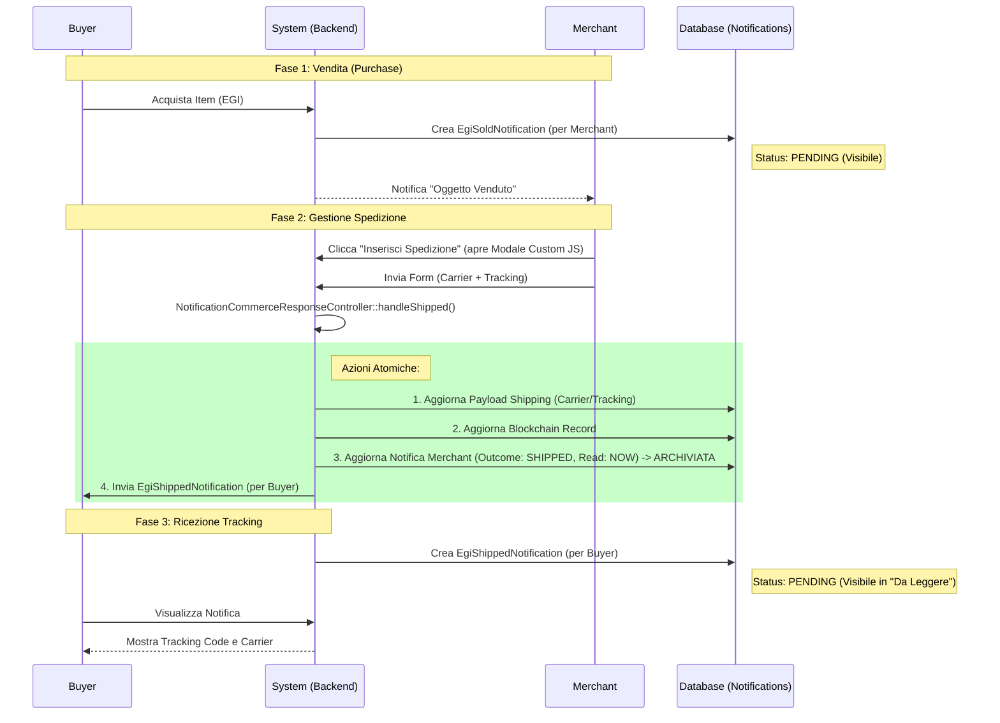

# Schema Flusso Notifiche Commerce

Questo documento dettaglia il flusso completo delle notifiche per il processo di vendita e spedizione (Commerce Flow), documentando l'architettura aggiornata che utilizza Enum e logica a stati.

## 1. Panoramica del Flusso
Il flusso gestisce due attori principali:
*   **Merchant (Venditore)**: Riceve l'ordine e deve spedire.
*   **Buyer (Acquirente)**: Paga e attende la spedizione.

Il sistema utilizza un meccanismo a stati basato su `NotificationStatus` per sincronizzare le notifiche e garantire che il Buyer sia informato quando la merce parte.

---

## 2. Diagramma di Sequenza (Mermaid)



---

## 3. Dettaglio Componenti e Stati

### A. Enum Utilizzati
Tutti gli stati sono definiti rigorosamente in `App\Enums\NotificationStatus`:
*   `PENDING`: Stato iniziale di visibilità (usato per la notifica al Buyer).
*   `SHIPPED`: Nuovo stato (aggiunto) che indica l'avvenuta spedizione. Usato per chiudere la notifica del Merchant.

### B. Canale di Notifica (`CustomDatabaseChannel`)
Il canale Database è intelligente e mappa le **Classi di Notifica** agli **Esiti (Outcome)**.

| Notifica Input | Mappatura Enum | Effetto |
| :--- | :--- | :--- |
| `EgiShippedNotification` | `NotificationStatus::SHIPPED` | Aggiorna la *precedente* notifica collegata (Sold) impostandola come gestita. |

**Codice Rilevante (`CustomDatabaseChannel.php`):**
```php
$actionResponseMap = [
    // ...
    'App\Notifications\Commerce\EgiShippedNotification' => NotificationStatus::SHIPPED,
];

if ($action === NotificationStatus::SHIPPED) {
    // Chiude la notifica precedente (quella del venditore)
    $this->updatePreviousNotification($notification_prevId, $action);
}
```

### C. Controller di Risposta (`NotificationCommerceResponseController`)
Gestisce l'azione POST inviata dalla modale JS.

1.  **Validazione**: Verifica Carrier e Tracking Code.
2.  **Aggiornamento Dati**: Salva i dati nel `NotificationPayloadShipping` e nel record `EgiBlockchain`.
3.  **Invio Notifica Buyer**: Istanzia `EgiShippedNotification`.
    *   **Importante**: L'outcome di questa nuova notifica è forzato a `NotificationStatus::PENDING` (vedi sotto) per assicurare che appaia nella lista "Da Leggere" del Buyer.
4.  **Chiusura Task Merchant**: Aggiorna la notifica originale del Merchant:
    ```php
    $notification->update([
        'outcome' => NotificationStatus::SHIPPED->value, // Archiviazione logica
        'read_at' => now(), // Archiviazione visiva (rimuove da lista pending)
    ]);
    ```

### D. La Notifica al Buyer (`EgiShippedNotification`)
Questa classe costruisce il messaggio per l'acquirente.

**Stato di Visibilità:**
Per garantire che il Buyer veda la notifica, il metodo `toCustomDatabase` imposta esplicitamente:
```php
'outcome' => \App\Enums\NotificationStatus::PENDING->value
```
*(Precedentemente era hardcoded a 'done', causando l'invisibilità immediata).*

## 4. Architettura UI (Modale)
La modale di inserimento dati (in `egi_sold.blade.php`) è stata riscritta per rispettare la regola **P0-0 NO ALPINE/LIVEWIRE**:
*   **Struttura**: HTML puro con classi Tailwind (`hidden`/`flex`).
*   **Logica**: Vanilla JS inline (`document.getElementById(...).classList.remove('hidden')`).
*   **Form**: POST standard verso la rotta `notifications.commerce.shipped`.

---

## 5. Riepilogo Correzioni Applicate
1.  **Hardcoded Strings**: Eliminate. Sostituite con `NotificationStatus::SHIPPED`.
2.  **Logic Bug**: `EgiShippedNotification` ora nasce come `PENDING` (visibile), non `done` (invisibile).
3.  **Channel Map**: Corretta la chiave della mappa in `CustomDatabaseChannel` per reagire alla classe `EgiShippedNotification`.
4.  **Controller**: Aggiornato per usare `NotificationStatus::SHIPPED->value` db-compliant.

---

## **Changelog**

### Versione 1.1 - 04 Febbraio 2026
- **[NEW]** Documentazione pattern Archive per notifiche Commerce
- **[UPDATE]** Aggiornamento diagramma Mermaid con fase archiviazione
- **[FIX]** Correzione riferimenti Enum (SHIPPED)

### Versione 1.0 - 04 Febbraio 2026
- Release iniziale Commerce Flow
- Diagramma sequenza completo
- Documentazione stati e transizioni
- Integrazione Channel-Driven Logic

---

*Documentazione creata da Antigravity (AI Partner OS3.0) per il progetto FlorenceEGI*  
*Versione 1.1 - Aggiornata il 04 Febbraio 2026*
