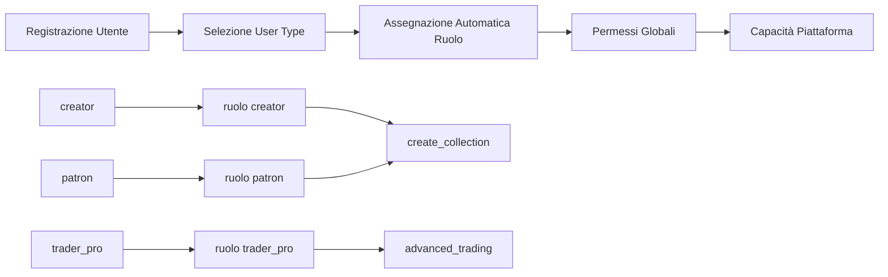
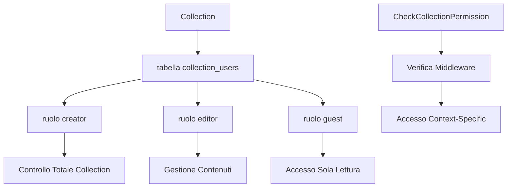

# Sistema Ruoli e Permessi FlorenceEGI

## Documentazione Oracode OS1 per Team di Sviluppo

**Autore:** Padmin D. Curtis (per Fabio Cherici)  
**Versione:** 2.0.0 - SISTEMA CORRETTO  
**Data:** 4 Giugno 2025  
**Target:** Team di Sviluppo  
**Compliance:** Oracode System 1 (OS1) Full Stack

---

## 📋 **Introduzione**

FlorenceEGI implementa un **sistema di autorizzazione a due livelli** progettato secondo i principi Oracode OS1 per massimizzare **flessibilità**, **sicurezza** e **scalabilità**. Il sistema combina **permessi di identità globale** (chi sei sulla piattaforma) con **permessi di contesto specifico** (cosa puoi fare in contesti specifici), eliminando completamente la necessità di controlli hardcoded sui tipi utente e abilitando una logica business completamente basata sui permessi.

### **Principi Architetturali OS1:**

- **🎯 Esplicitamente Intenzionale:** Ogni permesso ha uno scopo dichiarato e verificabile
- **🔧 Semplicità Potenziante:** Due livelli chiari invece di matrice complessa NxM
- **🎭 Coerenza Semantica:** Nomenclatura unificata attraverso tutti i layer
- **🔄 Circolarità Virtuosa:** Permessi che facilitano la collaborazione invece di bloccarla
- **📈 Evoluzione Ricorsiva:** Sistema che si adatta a nuovi user types senza breaking changes

### **Vantaggi Strategici:**

- **Zero Admin Override:** Pattern "My Data" per compliance GDPR totale
- **Permission-Based Logic:** Regole business guidate da capabilities, non da user types
- **Separazione Contesti:** Identità globale vs ruoli di collaborazione specifici
- **Scalabilità Infinita:** Nuovi user types = nuove combinazioni di permessi esistenti

---

## 🏗️ **Architettura del Sistema**

### **Livello 1: Identità Globale & Permessi Piattaforma**



**Mapping User Type → Spatie Role (1:1):**

```php
'creator' => 'creator',           // ✅ Può creare collections, EGI, team
'patron' => 'patron',             // ✅ Può creare collections (per supportare creators)
'collector' => 'collector',       // ❌ Non può creare collections (solo comprare/collezionare)
'enterprise' => 'enterprise',     // ✅ Può creare collections (uso business)
'trader_pro' => 'trader_pro',     // ❌ Non può creare collections (solo trading)
'epp_entity' => 'epp_entity',     // ❌ Non può creare collections (solo progetti EPP)
```

### **Livello 2: Contesto Collection & Ruoli Collaborativi**



**Ruoli Collection (Context-Specific):**

```php
'creator'  => 'Controllo completo: invitare, rimuovere, modificare tutto'
'editor' => 'Gestione contenuti: creare/modificare EGI, modificare contenuti'
'guest'  => 'Sola lettura: visualizzare collection, navigare EGI'
```

---

## 🧱 **Implementazione Tecnica**

### **Pattern 1: Controllo Permesso Globale**

```php
// ✅ CORRETTO: Logica business basata su permessi
if (auth()->user()->can('create_collection')) {
    // L'utente può creare un ecosistema completo
    $collection = $this->collectionService->create($user, $data);
    $this->walletService->attach($collection, $user);
    // etc...
}

// ❌ SBAGLIATO: Controllo hardcoded del tipo utente
if (in_array($user->usertype, ['creator', 'enterprise'])) {
    // Fragile, non scalabile, anti-OS1
}
```

### **Pattern 2: Controllo Contesto Collection**

```php
// In Controller specifico per Collection
class EgiController extends Controller 
{
    public function store(Request $request, Collection $collection)
    {
        // Il middleware CheckCollectionPermission ha già verificato
        // che l'utente abbia il ruolo 'admin' o 'editor' in QUESTA collection
        
        $egi = $collection->egis()->create($request->validated());
        
        return response()->json($egi);
    }
}

// Nel middleware CheckCollectionPermission
public function handle($request, Closure $next, $requiredRole = 'guest')
{
    $collection = $request->route('collection');
    $user = auth()->user();
    
    $membership = $collection->users()
        ->where('user_id', $user->id)
        ->first();
        
    if (!$membership || !$this->hasRequiredRole($membership->pivot->role, $requiredRole)) {
        abort(403, 'Permessi collection insufficienti');
    }
    
    return $next($request);
}
```

### **Pattern 3: Autorizzazione Combinata**

```php
// Esempio: Invitare qualcuno in una collection
public function inviteUser(Request $request, Collection $collection)
{
    // 1. CONTROLLO GLOBALE: può creare team?
    $this->authorize('create_team');
    
    // 2. CONTROLLO COLLECTION: è admin di questa collection?
    // (gestito dal middleware CheckCollectionPermission con parametro 'admin')
    
    // 3. LOGICA BUSINESS
    $invitedUser = User::find($request->user_id);
    $collection->users()->attach($invitedUser->id, [
        'role' => $request->role, // 'admin', 'editor', 'guest'
        'invited_by' => auth()->id(),
        'created_at' => now()
    ]);
    
    return redirect()->back()->with('success', 'Utente invitato con successo');
}
```

---

## 🎯 **Esempi Operativi**

### **Scenario 1: Creator Multifunzionale**

```php
$alice = User::find(1); // Alice è 'creator'

// ✅ PERMESSI GLOBALI (dal suo user type)
$alice->can('create_collection');     // true
$alice->can('create_EGI');           // true  
$alice->can('buy_egi');              // false (i creators si concentrano sulla creazione)

// ✅ PERMESSI SPECIFICI COLLECTION
// Collection A (creata da lei): 'admin'
// Collection B (invitata da Bob): 'editor'
// Collection C (invitata da Charlie): 'guest'

// In Collection A può fare tutto
// In Collection B può modificare contenuti ma non gestire team
// In Collection C può solo visualizzare
```

### **Scenario 2: Collector Specializzato**

```php
$bob = User::find(2); // Bob è 'collector'

// ✅ PERMESSI GLOBALI
$bob->can('create_collection');       // false (i collectors non creano)
$bob->can('buy_egi');                // true (funzione principale)
$bob->can('trade_egi');              // true (funzione secondaria)

// ✅ PERMESSI SPECIFICI COLLECTION
// Collection X: 'guest' (può vedere per valutare acquisti)
// Collection Y: 'editor' (il creator lo ha invitato a collaborare)

// Può comprare EGI dal marketplace
// Può collaborare come editor se invitato
// NON può creare proprie collections
```

### **Scenario 3: Enterprise Multi-Team**

```php
$corp = User::find(3); // Corporation è 'enterprise'

// ✅ PERMESSI GLOBALI
$corp->can('create_collection');      // true (collections business)
$corp->can('issue_invoices');        // true (funzionalità enterprise)
$corp->can('bulk_operations');       // true (scala enterprise)

// ✅ PERMESSI SPECIFICI COLLECTION
// Corporate Collection 1: 'admin' (creata da loro)
// Corporate Collection 2: 'admin' (creata da loro)
// Partner Collection: 'editor' (collaborazione B2B)

// Può gestire multiple collections corporate
// Può collaborare con partner esterni
// Ha strumenti enterprise (operazioni bulk, fatturazione)
```

---

## 🔧 **Linee Guida Implementazione**

### **Regola 1: Controller Permission-First**

```php
// ✅ SEMPRE usare permessi nei controller
class MyDataController extends Controller
{
    public function edit()
    {
        $this->authorize('edit_own_personal_data');
        // logica...
    }
    
    public function update(Request $request)  
    {
        $this->authorize('edit_own_personal_data');
        // logica...
    }
}
```

### **Regola 2: Middleware Context-Aware**

```php
// ✅ Route con middleware collection-aware
Route::middleware(['auth', 'collection.permission:editor'])
    ->post('/collections/{collection}/egi', [EgiController::class, 'store']);

// Il middleware verifica che l'utente abbia almeno il ruolo 'editor'
// nella collection specifica
```

### **Regola 3: Zero User Types Hardcoded**

```php
// ❌ EVITARE controlli hardcoded
if ($user->usertype === 'creator') { ... }

// ✅ USARE logica basata su permessi
if ($user->can('create_collection')) { ... }

// ✅ USARE contesto collection
if ($collection->userRole($user) === 'admin') { ... }
```

### **Regola 4: Degradazione Grazia dei Permessi**

```php
// ✅ UI che si adatta ai permessi
@can('create_collection')
    <a href="{{ route('collections.create') }}" class="btn btn-primary">
        Crea Collection
    </a>
@endcan

@can('edit_own_personal_data')
    <a href="{{ route('user.personal-data.edit') }}" class="btn btn-secondary">
        Modifica Dati Personali
    </a>
@endcan
```

---

## 🎨 **Pattern Integrazione Sidebar**

### **Sistema Esistente Perfetto: MenuConditionEvaluator**

Il sistema sidebar di FlorenceEGI è **già perfettamente OS1-compliant** attraverso `MenuConditionEvaluator`:

```php
// In ContextMenus.php - APPROCCIO CORRETTO
case 'dashboard':
    $user = auth()->user();
    
    // ✅ Menu basati su PERMESSI GLOBALI (NON user types)
    $collectionsMenu = new MenuGroup(__('menu.collections'), 'folder', [
        new CreateCollectionMenu(),    // permission: 'create_collection'
        new ManageCollectionsMenu(),   // permission: 'manage_collections'
    ]);
    $menus[] = $collectionsMenu;
    
    $tradingMenu = new MenuGroup(__('menu.trading'), 'chart-bar', [
        new TradingDashboardMenu(),    // permission: 'access_trading'
        new AdvancedToolsMenu(),       // permission: 'advanced_trading'
    ]);
    $menus[] = $tradingMenu;
    
    // ✅ Menu sempre disponibili (my data) - TUTTI creati
    $userDataMenu = new MenuGroup(__('menu.my_data'), 'user-cog', [
        new MyProfileMenu(),           // permission: 'edit_own_profile_data'
        new MyPersonalDataMenu(),      // permission: 'edit_own_personal_data'
        new MyOrganizationMenu(),      // permission: 'edit_own_organization_data'
        new MyDocumentsMenu(),         // permission: 'manage_own_documents'
        new MyInvoicePreferencesMenu(), // permission: 'manage_own_invoice_preferences'
    ]);
    $menus[] = $userDataMenu;
    break;

case 'collection':
    // ✅ Menu basati su PERMESSI COLLECTION
    $contentMenu = new MenuGroup(__('menu.content'), 'document', [
        new CreateEgiMenu(),           // middleware: 'collection.permission:editor'
        new ManageContentMenu(),       // middleware: 'collection.permission:editor'
    ]);
    $menus[] = $contentMenu;
    
    $teamMenu = new MenuGroup(__('menu.team'), 'users', [
        new InviteMemberMenu(),        // middleware: 'collection.permission:admin'
        new ManageRolesMenu(),         // middleware: 'collection.permission:admin'
    ]);
    $menus[] = $teamMenu;
    break;
```

### **Il Filtro Automatico Perfetto**

Il sistema `MenuConditionEvaluator` filtra automaticamente:

```php
// In MenuConditionEvaluator.php
public function shouldDisplay(MenuItem $menuItem): bool
{
    // Se non è richiesto un permesso, mostra sempre
    if (empty($menuItem->permission)) {
        return true;
    }

    // ✅ Controllo basato su PERMESSI (non user types)
    return FegiAuth::check() && FegiAuth::can($menuItem->permission);
}
```

### **❌ ERRORE DA NON RIPETERE**

```php
// ❌ MAI fare questo in ContextMenus
...(auth()->user()->usertype === 'enterprise' ? [new MyOrganizationMenu()] : []),

// ✅ SEMPRE fare questo
new MyOrganizationMenu(), // MenuConditionEvaluator filtrerà automaticamente
```

---

## 🧪 **Pattern di Testing**

### **Test Permessi Globali**

```php
class GlobalPermissionTest extends TestCase
{
    /** @test */
    public function creator_puo_creare_collections()
    {
        $user = User::factory()->create(['usertype' => 'creator']);
        $user->assignRole('creator');
        
        $this->assertTrue($user->can('create_collection'));
        
        $response = $this->actingAs($user)
            ->post(route('collections.store'), $this->validCollectionData());
            
        $response->assertStatus(201);
    }
    
    /** @test */
    public function trader_pro_non_puo_creare_collections()
    {
        $user = User::factory()->create(['usertype' => 'trader_pro']);
        $user->assignRole('trader_pro');
        
        $this->assertFalse($user->can('create_collection'));
        
        $response = $this->actingAs($user)
            ->post(route('collections.store'), $this->validCollectionData());
            
        $response->assertStatus(403);
    }
}
```

### **Test Contesto Collection**

```php
class CollectionPermissionTest extends TestCase
{
    /** @test */
    public function admin_collection_puo_invitare_utenti()
    {
        $collection = Collection::factory()->create();
        $admin = User::factory()->create();
        $collection->users()->attach($admin->id, ['role' => 'admin']);
        
        $response = $this->actingAs($admin)
            ->post(route('collections.invite', $collection), [
                'user_id' => User::factory()->create()->id,
                'role' => 'editor'
            ]);
            
        $response->assertStatus(200);
    }
    
    /** @test */
    public function guest_collection_non_puo_invitare_utenti()
    {
        $collection = Collection::factory()->create();
        $guest = User::factory()->create();
        $collection->users()->attach($guest->id, ['role' => 'guest']);
        
        $response = $this->actingAs($guest)
            ->post(route('collections.invite', $collection), [
                'user_id' => User::factory()->create()->id,
                'role' => 'editor'
            ]);
            
        $response->assertStatus(403);
    }
}
```

---

## 🚀 **Pattern Avanzati**

### **Valutazione Dinamica Permessi**

```php
// Helper per valutazione complessa
class PermissionHelper
{
    public static function canAccessFeature(User $user, string $feature, ?Collection $collection = null): bool
    {
        return match($feature) {
            'create_egi' => $user->can('create_EGI') && 
                           ($collection ? $collection->userRole($user) !== 'guest' : true),
                           
            'manage_team' => $user->can('create_team') && 
                           ($collection ? $collection->userRole($user) === 'admin' : false),
                           
            'advanced_analytics' => $user->can('view_trading_analytics') || 
                                  $user->can('corporate_analytics'),
                                  
            default => false
        };
    }
}
```

### **Caricamento Menu Condizionale**

```php
// MenuItem con logica complessa
class ConditionalEgiMenu extends MenuItem
{
    public function __construct()
    {
        parent::__construct(
            'menu.create_egi',
            'egi.create',
            'plus-circle',
            null // Nessun permesso singolo - logica custom
        );
    }
    
    public function isVisible(): bool
    {
        $user = auth()->user();
        $collection = request()->route('collection');
        
        return PermissionHelper::canAccessFeature($user, 'create_egi', $collection);
    }
}
```

---

## 📊 **Considerazioni Performance**

### **Caching Permessi**

```php
// I permessi Spatie sono già cachati, ma per logiche complesse:
class CachedPermissionService
{
    public function userCollectionRole(User $user, Collection $collection): string
    {
        return Cache::remember(
            "user_{$user->id}_collection_{$collection->id}_role",
            300, // 5 minuti
            fn() => $collection->users()
                ->where('user_id', $user->id)
                ->first()?->pivot?->role ?? 'none'
        );
    }
}
```

### **Controlli Permessi Bulk**

```php
// Per sidebar con molti menu items
class BulkPermissionChecker
{
    public function checkMultiple(User $user, array $permissions): array
    {
        // Singola query invece di N query
        return $user->permissions()
            ->whereIn('name', $permissions)
            ->pluck('name')
            ->toArray();
    }
}
```

---

## ⚡ **Riferimento Rapido**

### **Permessi Globali Cheat Sheet**

```bash
# User Types → Permessi Chiave
creator:     create_collection, create_EGI, create_team
patron:      create_collection, support_creators, buy_egi  
collector:   buy_egi, trade_egi, manage_personal_collection
enterprise:  create_collection, issue_invoices, bulk_operations
trader_pro:  advanced_trading, access_pro_tools, bulk_trade_operations
epp_entity:  create_epp_projects, certify_sustainability
```

### **Ruoli Collection Cheat Sheet**

```bash
# Contesto Collection → Capacità
admin:   invitare, rimuovere, modificare_tutto, creare_egi, gestire_team
editor:  creare_egi, aggiornare_egi, modificare_contenuti
guest:   visualizzare_collection, visualizzare_egi, sola_lettura
```

### **Pattern Comuni**

```php
// Controllo capacità globale
if ($user->can('nome_permesso')) { ... }

// Controllo contesto collection  
if ($collection->userRole($user) === 'admin') { ... }

// Controllo combinato
if ($user->can('perm_globale') && $collection->userRole($user) !== 'guest') { ... }

// Condizionale menu
@can('nome_permesso') ... @endcan

// Protezione route
Route::middleware('can:nome_permesso')->group(...)
```

---

## 🎯 **Conclusioni OS1**

Questo sistema di autorizzazione è progettato secondo i **5 Pilastri Cardinali di Oracode OS1**:

### **✅ Esplicitamente Intenzionale**

Ogni permesso ha uno scopo chiaro e verificabile. Zero ambiguità su chi può fare cosa.

### **✅ Semplicità Potenziante**

Due livelli distinti invece di matrice complessa NxM. Facile da capire, debuggare, estendere.

### **✅ Coerenza Semantica**

Nomenclatura unificata attraverso user types, ruoli, permessi, contesti.

### **✅ Circolarità Virtuosa**

Permessi che facilitano la collaborazione. Ruoli collection che crescono con la fiducia.

### **✅ Evoluzione Ricorsiva**

Sistema che si adatta senza breaking changes. Nuovi user types = nuove combinazioni.

**Il sistema è production-ready, scalabile e manutenibile per qualsiasi dimensione di team.** 🔥

### **Funzionalità Future (Prossimi Level):**

- **Permessi temporali** (accesso temporaneo a collections)
- **Collections gerarchiche** (sub-collections con ereditarietà permessi)
- **Permessi cross-collection** (grants di accesso tra collections)
- **Trail audit avanzati** (tracking modifiche permessi)

**Questo documento è la fonte di verità per tutto il team.** 📚✨