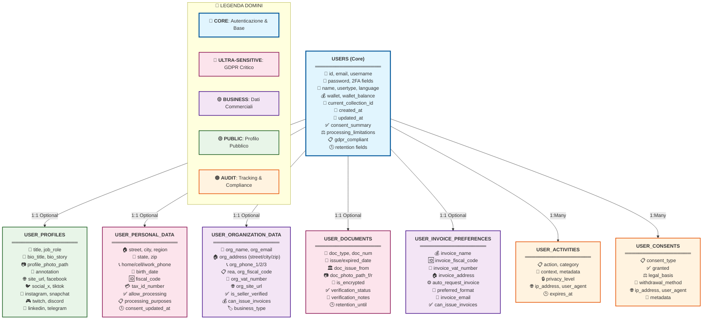

```mermaid
graph TD
    %% Stile per i diversi tipi di tabelle
    classDef coreTable fill:#e1f5fe,stroke:#01579b,stroke-width:3px
    classDef sensitiveTable fill:#fce4ec,stroke:#880e4f,stroke-width:2px
    classDef businessTable fill:#f3e5f5,stroke:#4a148c,stroke-width:2px
    classDef publicTable fill:#e8f5e8,stroke:#1b5e20,stroke-width:2px
    classDef auditTable fill:#fff3e0,stroke:#e65100,stroke-width:2px
    
    %% Tabella Core centrale
    USERS["`**USERS (Core)**
    ═══════════════════
    🔑 id, email, username
    🔐 password, 2FA fields
    🎯 name, usertype, language
    💰 wallet, wallet_balance
    🔗 current_collection_id
    📅 created_at
    📅 updated_at
    ✅ consent_summary
    ⚖️ processing_limitations
    📋 gdpr_compliant
    🕒 retention fields`"]
    
    %% Tabelle di dominio
    PROFILE["`**USER_PROFILES**
    ═══════════════════
    👤 title, job_role
    📝 bio_title, bio_story
    📷 profile_photo_path
    💬 annotation
    🌐 site_url, facebook
    🐦 social_x, tiktok
    📸 instagram, snapchat
    🎮 twitch, discord
    💼 linkedin, telegram`"]
    
    PERSONAL["`**USER_PERSONAL_DATA**
    ═══════════════════
    🏠 street, city, region
    📮 state, zip
    📞 home/cell/work_phone
    🎂 birth_date
    🆔 fiscal_code
    💳 tax_id_number
    ✅ allow_processing
    📋 processing_purposes
    🕒 consent_updated_at`"]
    
    ORG["`**USER_ORGANIZATION_DATA**
    ═══════════════════
    🏢 org_name, org_email
    🏠 org_address (street/city/zip)
    📞 org_phone_1/2/3
    📋 rea, org_fiscal_code
    💼 org_vat_number
    🌐 org_site_url
    ✅ is_seller_verified
    💰 can_issue_invoices
    🏷️ business_type`"]
    
    DOCS["`**USER_DOCUMENTS**
    ═══════════════════
    📄 doc_type, doc_num
    📅 issue/expired_date
    🏛️ doc_issue_from
    📷 doc_photo_path_f/r
    🔐 is_encrypted
    ✅ verification_status
    📝 verification_notes
    🕒 retention_until`"]
    
    INVOICES["`**USER_INVOICE_PREFERENCES**
    ═══════════════════
    💰 invoice_name
    🆔 invoice_fiscal_code
    💼 invoice_vat_number
    🏠 invoice_address
    ⚙️ auto_request_invoice
    📄 preferred_format
    📧 invoice_email
    ✅ can_issue_invoices`"]
    
    %% Tabelle di audit e tracking
    ACTIVITIES["`**USER_ACTIVITIES**
    ═══════════════════
    📋 action, category
    🎯 context, metadata
    🔒 privacy_level
    🌐 ip_address, user_agent
    🕒 expires_at`"]
    
    CONSENTS["`**USER_CONSENTS**
    ═══════════════════
    📋 consent_type
    ✅ granted
    ⚖️ legal_basis
    🔄 withdrawal_method
    🌐 ip_address, user_agent
    📝 metadata`"]
    
    %% Relazioni
    USERS -->|"1:1 Optional"| PROFILE
    USERS -->|"1:1 Optional"| PERSONAL
    USERS -->|"1:1 Optional"| ORG
    USERS -->|"1:1 Optional"| DOCS
    USERS -->|"1:1 Optional"| INVOICES
    USERS -->|"1:Many"| ACTIVITIES
    USERS -->|"1:Many"| CONSENTS
    
    %% Applicazione degli stili
    class USERS coreTable
    class PERSONAL,DOCS sensitiveTable
    class ORG,INVOICES businessTable
    class PROFILE publicTable
    class ACTIVITIES,CONSENTS auditTable
    
    %% Legenda
    subgraph LEGEND["🎯 LEGENDA DOMINI"]
        CORE_LEGEND["`🔵 **CORE**: Autenticazione & Base`"]
        SENSITIVE_LEGEND["`🔴 **ULTRA-SENSITIVE**: GDPR Critico`"]
        BUSINESS_LEGEND["`🟣 **BUSINESS**: Dati Commerciali`"]
        PUBLIC_LEGEND["`🟢 **PUBLIC**: Profilo Pubblico`"]
        AUDIT_LEGEND["`🟠 **AUDIT**: Tracking & Compliance`"]
    end
    
    class CORE_LEGEND coreTable
    class SENSITIVE_LEGEND sensitiveTable
    class BUSINESS_LEGEND businessTable
    class PUBLIC_LEGEND publicTable
    class AUDIT_LEGEND auditTable
```