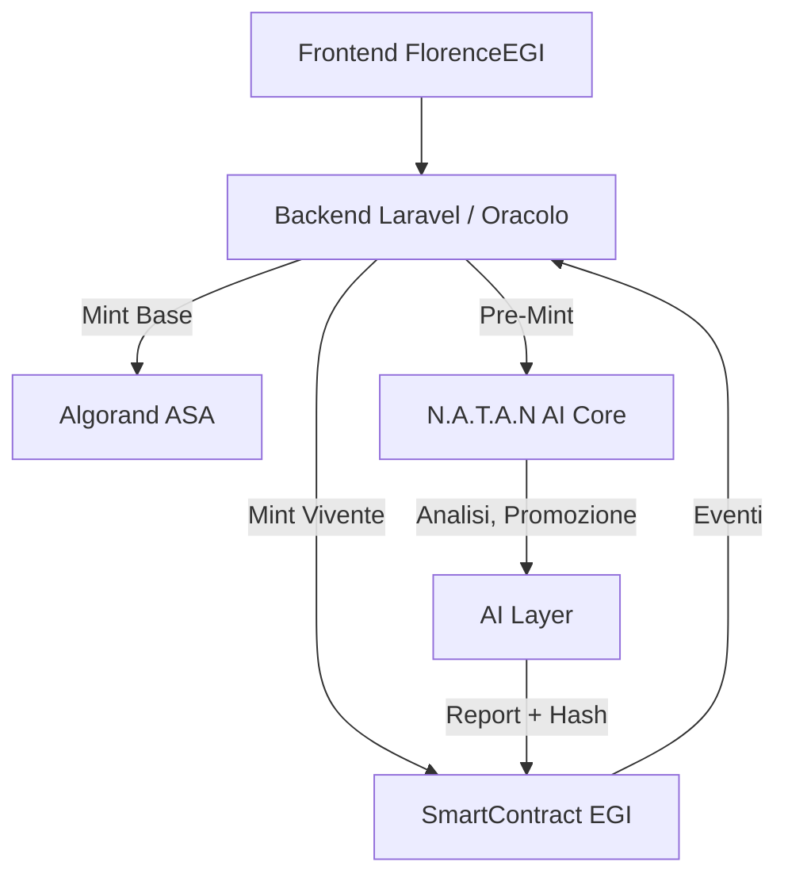

# 🧭 1. Overview

FlorenceEGI evolve dall'attuale infrastruttura **ASA (Algorand Standard Asset)** verso una **architettura duale**, dove ogni EGI può esistere in due modalità operative:

- **EGI Classico (ASA)** → asset statico, notarizzato su blockchain.  
- **EGI Vivente (SmartContract)** → asset autonomo con logica, trigger, AI e memoria evolutiva.

Questa transizione consente di mantenere la piena compatibilità con gli EGI esistenti e introdurre nuove funzionalità intelligenti come servizio premium.

---

# ⚙️ 2. Architettura Doppia

| Modalità | Tecnologia | Stato | Funzioni principali |
|-----------|-------------|-------|---------------------|
| **EGI Base** | ASA | attuale | autenticità, proprietà, trading base |
| **EGI Vivente** | SmartContract | nuova | analisi AI, auto-curatela, marketing, provenance, audit |
| **EGI Pre-Mint** | DB + AI Layer | transitoria | test, promozione, training AI prima del mint on-chain |

### Diagramma



---

# 💳 3. Modello Economico

- **EGI Base** → gratuito o incluso.  
- **EGI Vivente** → servizio premium (attivazione a pagamento).  
- L’attivazione abilita:  
  - AI Curator  
  - AI Promoter  
  - Provenance Graph  
  - Passaporto Espositivo  
  - Anchoring automatico

---

# 🧠 4. Flussi di Creazione

## 4.1 Mint immediato (Creator Mint)

1. Creator carica opera e metadati.  
2. Seleziona “Mint EGI Vivente”.  
3. SmartContract dedicato viene deployato.  
4. N.A.T.A.N effettua auto-analisi iniziale (nome, descrizione, traits).  
5. L’EGI diventa attivo nel marketplace, con funzioni autonome.

**Uso:** opere di valore, collezioni ufficiali, artisti professionisti.

---

## 4.2 Pre-Mint gestito da N.A.T.A.N

1. L’artista crea un EGI **virtuale**, non ancora mintato.  
2. L’AI lo promuove, analizza, genera descrizioni e interazioni.  
3. Quando il creator decide:  
   - Mint come ASA → `mintEGI(type="ASA")`  
   - Mint come SmartContract → `mintEGI(type="SmartContract")`  
4. Il sistema migra metadati e log verso la blockchain.

**Uso:** test, promozione iniziale, riduzione costi di gas.

---

# 🧩 5. Struttura SmartContract (EGI Skeleton v1.0)

```python
class EGIContract(Application):
    creator = GlobalStateValue(stack_type=TealType.bytes)
    authorized_agent = GlobalStateValue(stack_type=TealType.bytes)
    next_trigger = GlobalStateValue(stack_type=TealType.uint64)
    interval = GlobalStateValue(stack_type=TealType.uint64)
    metadata_hash = GlobalStateValue(stack_type=TealType.bytes)
    license_id = GlobalStateValue(stack_type=TealType.uint64)
    terms_hash = GlobalStateValue(stack_type=TealType.bytes)
    exhibit_refs = GlobalStateBlob()
    epp_id = GlobalStateValue(stack_type=TealType.uint64)
    anchoring_root = GlobalStateValue(stack_type=TealType.bytes)
    audit_log = GlobalStateBlob()

    @external
    def request_analysis(self):
        if Global.latest_timestamp() >= self.next_trigger.get():
            log("RequestAnalysis")

    @external
    def update_state(self, new_hash: abi.String):
        assert Txn.sender == self.authorized_agent.get()
        self.metadata_hash.set(new_hash.get())
        log("EGIUpdated", new_hash)
```

---

# 🔗 6. Componenti di Sistema

| Componente | Ruolo |
|-------------|--------|
| **SmartContract EGI** | Stato, eventi, audit, sicurezza. |
| **Oracolo FlorenceEGI** | Ponte AI ↔ Blockchain. |
| **AI Core (N.A.T.A.N)** | Analisi, storytelling, marketing, moderazione. |
| **Backend Laravel** | Gestione utenti, storage, API, mint orchestration. |
| **Frontend React/TS** | UI dinamica, interfaccia di creazione e controllo. |

---

# 🧱 7. Campi Global State

| Campo | Tipo | Descrizione |
|-------|------|-------------|
| `creator` | address | Wallet del creator. |
| `authorized_agent` | address | Wallet dell’oracolo/AI. |
| `metadata_hash` | bytes | Hash IPFS dei metadati aggiornati. |
| `interval` | uint | Intervallo analisi AI. |
| `next_trigger` | uint | Timestamp prossimo trigger. |
| `license_id` | uint | ID licenza dinamica. |
| `anchoring_root` | bytes | Merkle root giornaliera. |

---

# 📅 8. Roadmap di Migrazione

| Step | Obiettivo |
|------|------------|
| 1 | Continuare mint ASA (retrocompatibilità). |
| 2 | Deploy EGI Skeleton SmartContract v1. |
| 3 | Aggiornare backend per gestione doppia ASA/SmartContract. |
| 4 | Implementare Pre-Mint AI. |
| 5 | Lanciare servizio EGI Viventi (premium). |

---

# ✅ 9. Principi di Design

- **Modularità:** contratto unico predisposto per future funzioni.  
- **Compatibilità:** ogni EGI ha `EGI_UID` univoco cross-model.  
- **Trasparenza:** tutti i log e output AI hashati e verificabili.  
- **Controllo umano:** AI propone, creator approva.  
- **Scalabilità:** architettura ibrida ASA + SmartContract + AI.

---

# 🔮 10. Visione Finale

> Un EGI non è più solo un certificato, ma **un oggetto intelligente, capace di analizzarsi, raccontarsi e interagire** con il mondo in modo verificabile e trasparente.

FlorenceEGI diventa la prima piattaforma etica dove:
- l’artista sceglie il livello di vita digitale della sua opera,  
- la blockchain garantisce la memoria,  
- l’AI ne amplifica la voce,  
- e ogni interazione resta verificabile nel tempo.
